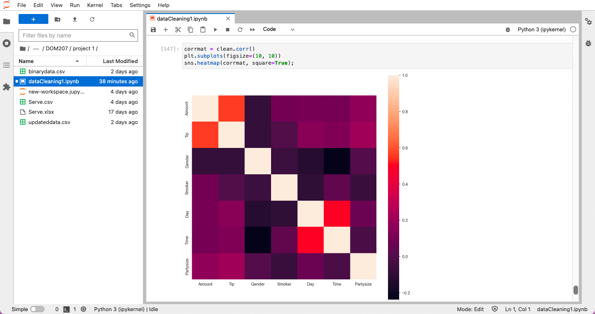
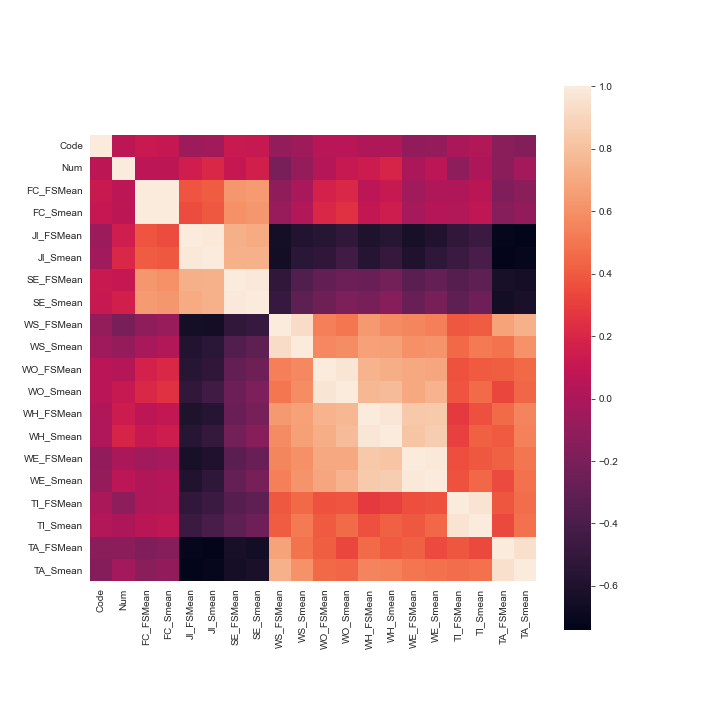

# Anj_portfolio
Example data science portfolio 🌻

Data Science projects:

## Project 1. Data Analytics for Restaurant Management

The data collection team of a restaurant-based business handed over a set of data related to the restaurant's performance, which was to be analysed to find valuable insights. This data analytics project focuses on deriving insights from the information provided using various aspects and tools in data analytics. The aim is to provide some exciting business recommendations to the upper-level management executive in the company that runs a restaurant business in India.
After getting familiarised with the data, a data cleansing process was initially undertaken to perform a sanity check and address missing and erroneous values. This was followed by data visualisation and calculating the descriptive statistics. By interpreting the results of visualisation and descriptive statistics, the problem statement, i.e., the potential area of improvement, was identified.

### Index:

Introduction

Data Cleansing
1. Missing Values
2. Data types and Uniformity

Descriptive Statistics
1. Mean
2. Median
3. Mode
4. Standard Deviation
5. Variance
6. Quartiles

Data Visualization

Plot 1: Frequency of variables (Histogram) 
Plot 2: Amount vs Day (Box Plot)
Plot 3: Amount vs Tip (Scatter Plot)
Plot 4: Gender vs Tips
Plot 5: Party size vs Amount

Data Analysis:
1. Hypothesis
Problem Statements

Recommendations

Some results based on the data provided to us:

## Project 2. Issues of ICT workers

The company CX has handed over a dataset related to ICT workers’ individual issues for 37 countries of the world. There were variables describing various kinds of issues including job insecurity, self-efficacy, work satisfaction, etc. This data analytics project focuses on deriving insights from the information provided using various aspects and tools in data analytics. The aim is to group the countries based on the scores of the individual issues of ICT workers.
After getting familiarized with the data, a data cleaning process was done and was followed by data visualization and calculating the descriptive statistics. The main analysis was carried out with the help of agglomerative hierarchical clustering and the groups that were formed upon clustering were interpreted accordingly.

)

### Final Results:

The above world maps represent all the issues country-wise and assign the darker colour shade to higher values and lighter shade to those with lesser values. It gives a fair idea about which countries have severe IT individual workers issues. Here we’re comparing how the distribution of the data is based on both the methods provided. 

)

## Project 3. Kaggle: Titanic - Machine Learning from Disaster

[Workbook Link:](https://www.kaggle.com/code/anjk2023/titanic-project-da-project-1)

[Kaggle competition page:](https://www.kaggle.com/competitions/titanic)

Problem Statement:

Tha data set provided is from the Titanic Survival from disaster, an ongoing challenge on Kaggle, and the programming language used in the data analysis is Python. PS: Knowing from a training set of samples listing passengers who survived or did not survive the Titanic disaster, can our model determine based on a given test dataset not containing the survival information, if these passengers in the test dataset survived or not.
Q - What kind of people are more likely to survive?
Data sets provided to us - train.csv, test.csv, gender_submission.csv

## Project 4. Data Analytics and machine learning on Covid 19 dataset (India) - IN PROGRESS

Keywords: COVID-19, machine learning, data analytics, time series forecasting, healthcare, government

ML Models - Arima Model, GMM, GANs, LSTM

In progress - LSTM, Transformer Machine Learning model, CGANs (Conditional Generative Adversial Networks)

Courses completed - 
1. Coursera - Google DA course certificate 1 Foundation Data, data everywhere by GOOGLE
2. Coursera - Google Ask Questions to Make Data-Driven Decisions by GOOGLE
3. Coursera - Build Basic Generative Adversarial Networks (GANs) by DeepLearning.AI
4. Great Learning - Multivariate Time series analysis on Covid 19 data by Great Learning academy 
